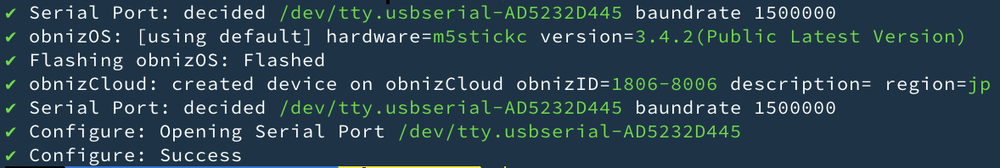

# obniz-cli

[日本語はこちら](./README-ja.md)

The obniz CLI is used to flashing and configuring obnizOS for processors.

About obniz? see https://obniz.com/

obniz-cli perform flashing, network configuring, also device creation on obniz Cloud.

```shell
obniz-cli os:flash-create -p AUTO --config ./wifi-config.json
```

obniz-cli tested with

- Nodejs12 (MacOS 10.15 / Windows 10)

## Usage

call with `--help`

```shell
$ obniz-cli --help

USAGE
  $ obniz-cli [COMMAND]

COMMANDS

  signin              Signin to obniz cloud.
  signout             Signout

  user:info           Show current Logged in user

  os:flash-create     Flashing and configure target device and registrate it on your account on obnizCloud.
  os:flash            Flashing and configure target device.
  os:config           Configure obnizOS flashed device.
  os:config-via-wifi  Configure ObnizOS network via Wi-Fi from devices.
  os:erase            Fully erase a flash on target device.
  os:list             List of available obnizOS for specified hardware
  os:ports            Getting serial ports on your machine.
```

Each command may respond to help

```shell
$obniz-cli os:flash --help

Usage for
$obniz-cli os:flash

Flash obnizOS and configure it

[serial setting]
 -p --port      serial port path to flash.If not specified, the port list will be displayed.
 -b --baud      flashing baud rate. default to 1500000

[flashing setting]
 -h --hardware  hardware to be flashed. default to esp32w
 -v --version   obnizOS version to be flashed. default to latest one.

[configrations]
 -d --devicekey devicekey to be configured after flash. please quote it like "00000000&abcdefghijklkm"
 -i --id        obnizID to be configured. You need to signin before use this.
 -c --config    configuration file path. If specified obniz-cli proceed settings following file like setting wifi SSID/Password.
     --token     Token of api key which use instead of user signin.

[operation]
    --operation     operation name for setting.
    --indication    indication name for setting.

```

## Dependency

obniz-cli use [esptool](https://github.com/espressif/esptool) internally. Install it from [pip](https://pip.pypa.io/en/stable/installing/)

```
pip install esptool
```

And you need to instal Node.js on your machine.

If you are using Windows. You may need to install below before installing obniz-cli

```
npm install windows-build-tools -g
```

## Install

Install from npm

```shell
npm i obniz-cli -g
```

## signin

To use the obnizCloud features, you need to sign in or have the Token parameter for each command.
If you want to sign in, you can sign in with

```shell
obniz-cli signin
```

obniz Cloud authentication page will appear. Approve it, then obniz-cli get credential.

You can check currently signin user by using.

```shel
obniz-cli user:info
```

## About token

By passing the API Key Token as a parameter to each command, you can use it without signing in.
The API Key can be issued from the obniz Cloud developer console → Development → API Key.

```shel
obniz-cli os:flash-create --token=token_Bowk7ovyFXcOapGgcwxJTIx23P6WfdX1
```

## About Serial Port

Connect a device to your machine.
You can check available ports

```shel
obniz-cli os:ports
```

Some command require port arguments `-p`. If not specified, obniz-cli will automatically determine one port.

Below scan ports and ask you to choose one.

```shel
obniz-cli os:flash
```

Below will use specified port.

```shell
obniz-cli os:flash -p /dev/tty.USBSerial
```

`AUTO` will automatically guess and choose a one of ports.

```shel
obniz-cli os:flash -p AUTO
```

`--debugserial` option for logout all serial communication.

```shell
obniz-cli os:flash-create -p AUTO --debugserial
```

## os:flash-create

You can create one obnizID, write it, and complete the writing of the device key.
The account to create the obnizID will be the account you are signed in to, or the account specified in the Token parameter.

First, decide which obnizOS you want to use. If it is not specified, `obnizOS for esp32` will be selected automatically. You can check which hardware is available by using the following command.

```shell
$obniz-cli os:list

Available Hardwares on obnizCloud

  esp32w
  esp32p
  encored
  m5stack_basic
  m5stickc
  m5atom_lite

Versions for hardware=esp32w

  3.4.3
  3.4.2
  3.4.1
```

If you select m5stickc when writing, the latest version of obnizOS for M5StickC will be written.

You can generate obnizID in the cloud and write the OS including writing its device key as follows. Note that the serial port is set to automatic selection, so remove `-p AUTO` to select it by yourself.

```shel
obniz-cli os:flash-create -p AUTO --hardware m5stickc
```

If successful, you can see the generated obnizID and other information as follows.



You can also add a description to the obnizID when it is generated in the cloud.

```shel
obniz-cli os:flash-create -p AUTO --hardware m5stickc -- description "obniz for my home"
```

There is also `--config`, which allows you to configure network settings such as Wi-Fi.
You can also configure network settings such as Wi-Fi, etc. Please check what you can specify from help as follows.

```shel
obniz-cli os:flash-create --help
```

## Implementation of operations (business plan)

Once you have created the facility and the operation, you will be able to run the operation in obniz-cli.
If you pass the API Key in the token option, you don't need to log in to the obnizCloud, so you can securely request the configuration work.

Specify the operation name in the operation option and the instruction ID in the indication option.

```shel
obniz-cli os:flash-create --operation obnizBuilding --indication ob-0 --token token_Bowk7ovyFXcOpGgcwxJTIasdf6WfdX1GOB
```

If you want to write to the device sequentially, you can use next as the indication option.
If next is specified, the system will automatically select the indication IDs that have not yet been completed.

```shel
obniz-cli os:flash-create --operation obnizBuilding --indication next --token token_Bowk7ovyFXcOpGgcwxJTIasdf6WfdX1GOB
```

### Binding Token (for partners only)

If you are an obniz partner and want to bind obnizID to serial code, use `--bindtoken`.

```shel
obniz-cli os:flash-create -p AUTO --hardware m5stickc --bindtoken
```

After startup, you will be prompted to accept a serial token string as shown below.

```
? Scan QR Code. Waiting...
```

You can link obnizID, which is generated by scanning QR with a barcode reader, with the QR (serial code) you have scanned.

## Flashing with creation of obnizID

Flashing obnizOS and adding a device on your account at once.
Before to do this, You need to add payment method on your account.

Connect target device to your machine. And call like below.

```shel
obniz-cli os:flash-create --description "For testing" -p /dev/tty.USBSERIAL
```

You can see generated device on your shell and obnizCloud.

## os:flash

Flashing the latest obnizOS for default hardware type.

```shell
obniz-cli os:flash -p /dev/tty.USBSERIAL
```

Version of obnizOS is determined for latest one. You can check available versions.

```shell
$obniz-cli os:list

Available Hardwares on obnizCloud

  esp32w
  esp32p
  encored
  m5stack_basic
  m5stickc
  m5atom_lite

Versions for hardware=esp32w

  3.4.3
  3.4.2
  3.4.1
```

You can specify version by using `--version`.

### DeviceKey Configration

If you specify obnizID or Devicekey, obniz-cli will configure it for your device.

Specify obnizID to be configured. Devicekey will be downloaded from Cloud and flashed to your device.

```
obniz-cli os:flash --id 0000-0000  -p /dev/tty.USBSERIAL --config ./wifi-config.json
```

Or, you can specify Devicekey like below

```
obniz-cli os:flash --devicekey '00000000&4591c82b119e12bd3b55ca5cb6493bcc498b63fe5448e06a' --config ./wifi-config.json
```

## Network Configration

Specify json format configration file path when flashing.
obniz-cli will automatically configre it.
`os:flash` and `os:flash-create` will perform that.

See [example](./example_config.json)

JSON file format is defined in [obnizOS Reference](https://obniz.com/doc/reference/obnizos-for-esp32/settings/).

For OS3.4.5 and older [See](./docs/config-345andolder.md).

```shell
obniz-cli os:flash -p /dev/tty.USBSERIAL -i 0000-0000 --config ./wifi-config.json
```

## os:config-via-wifi

You can use the Wi-Fi of the computer on which this software is running to configure it via Wi-Fi. [via W-Fi](https://obniz.com/doc/reference/obnizos-for-esp32/settings/setting-via-browser).

This is used to make the same settings for a large number of devices.

The settings you want to make are specified in a json file as in the case of priority.
By specifying the json file with the following command, it will find the devices using Wi-Fi and configure them sequentially.
The flow is as follows

1. start with the following command
2. connect multiple unconfigured devices to the power supply anyway.
3. Disconnect the ones whose LEDs are online from the power supply.

If the device is in startup configuration mode (which you can enter by pressing and holding the button after booting), it will automatically reset the network and then reconnect to the device to write the settings.

```shell
obniz-cli os:config-via-wifi --config ./wifi-config.json
```


Pass `--duplicate false` parameter if you don't want to sent data to same device. But "data send success" doesn't mean device is online.
