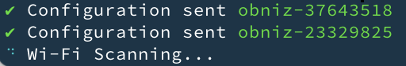

# obniz-cli

[日本語はこちら](./README-ja.md)

The obniz CLI is used to flashing and configuring obnizOS for processors.

About obniz? see https://obniz.com/


obniz-cli perform flashing, network configuring, also device creation on obniz Cloud.

```shell
obniz-cli os:flash-create -p AUTO --config ./wifi-config.json
```


obniz-cli tested with

 - Nodejs12 (MacOS 10.15 / Windows 10)


### Dependency

obniz-cli use [esptool](https://github.com/espressif/esptool) internally. Install it from [pip](https://pip.pypa.io/en/stable/installing/)

```
pip install esptool
```

And you need to instal Node.js on your machine.

If you are using Windows. You may need to install below before installing obniz-cli

```
npm install windows-build-tools -g
```

## Install

Install from npm

```shell
npm i obniz-cli -g
```


##  Signin

First of all, singin to your account

```shell
obniz-cli signin
```

obniz Cloud authentication page will appear. Approve it, then obniz-cli get credential.

You can check currently signin user by using.

```shel
obniz-cli user:info
```

## Serial Port

Connect a device to your machine.
You can check available ports

```shel
obniz-cli os:ports
```

Some command require port arguments `-p`. If not specified, obniz-cli will automatically determine one port.


Below scan ports and ask you to choose one.

```shel
obniz-cli os:flash
```

Below will use specified port.

```shell
obniz-cli os:flash -p /dev/tty.USBSerial
```

`AUTO` will automatically guess and choose a one of ports.

```shel
obniz-cli os:flash -p AUTO
```

`--debugserial` option for logout all serial communication.

```shell
obniz-cli os:flash-create -p AUTO --debugserial
```


## Flashing

obniz-cli Do flashing obnizOS and setting once.

1. Flashing obnizOS by using esptool
2. setting your device DeviceKey and network setting via serial console.

obniz-cli expect device can be entered bootload mode by using RTS.
If your device should be operated manually, follow shell print.

## Flashing with creation of obnizID

Flashing obnizOS and adding a device on your account at once.
Before to do this, You need to add payment method on your account.

Connect target device to your machine. And call like below.

```shel
obniz-cli os:flash-create --description "For testing" -p /dev/tty.USBSERIAL
```

You can see generated device on your shell and obnizCloud.


## Flashing without creation.

Flashing the latest obnizOS for default hardware type.

```shell
obniz-cli os:flash -p /dev/tty.USBSERIAL
```

Version of obnizOS is determined for latest one. You can check available versions.

```shell
$obniz-cli os:list

Available Hardwares on obnizCloud

  esp32w
  esp32p
  encored
  m5stack_basic
  m5stickc
  m5atom_lite

Versions for hardware=esp32w

  3.4.3
  3.4.2
  3.4.1
```

You can specify version by using `--version`.

### DeviceKey Configration

If you specify obnizID or Devicekey, obniz-cli will configure it for your device.

Specify obnizID to be configured. Devicekey will be downloaded from Cloud and flashed to your device.

```
obniz-cli os:flash --id 0000-0000  -p /dev/tty.USBSERIAL --config ./wifi-config.json
```

Or, you can specify Devicekey like below

```
obniz-cli os:flash --devicekey '00000000&4591c82b119e12bd3b55ca5cb6493bcc498b63fe5448e06a' --config ./wifi-config.json
```

## Network Configration

Specify json format configration file path when flashing.
obniz-cli will automatically configre it.

See [example](./example_config.json)

```json
{
  "networks":[
    {
      "type": "wifi",
      "settings": {
        "ssid": "exampl_essid",
        "password": "example_password"
      }
    }
  ]
}
```

### Type

| Type | Description |
|---|---|
|wifi| Wi-Fi  |
|ethernet| Ethernet |
|cellular| Cellular |

### Settings for Wi-Fi

| Key | Required | Default | Description |
|---|---|---|---|
|ssid| yes |  | SSID for Wi-Fi |
|password| yes |  | Password for Wi-Fi |
|hidden| no | false | If `false`, then device connect only found SSID and will save Wi-Fi only when connection established. If `true`, then device will store Wi-Fi setting and treat SSID as hidden SSID. Device will connect without scanning on startup. |
|dhcp| no | true | Use DHCP or not. If `false`, specify static ip settings |
|static_ip| no | automatic | Static IP |
|default_gateway| no | automatic | Gateway IP |
|subnetmask| no | automatic | Subnetmask |
|dns| no |  | DNS Server IP |
|proxy| no | false | Use Proxy or not. |
|proxy_address| no |  | Proxy Address |
|proxy_port| no |  | Proxy Port |


`os:flash` and `os:flash-create` will perform that.

```shell
obniz-cli os:flash -p /dev/tty.USBSERIAL -i 0000-0000 --config ./wifi-config.json
```

### Network Configuration via obnizOS Wi-Fi

Above network configuration can be done [via W-Fi](https://obniz.com/doc/reference/obnizos-for-esp32/settings/setting-via-browser), without a physical connection.  

```shell
obniz-cli os:config-via-wifi --config ./wifi-config.json
```

It will continue search Wi-Fi and connect then configure it via Wi-Fi.




Pass `--duplicate false` parameter if you don't want to sent data to same device. But "data send success" doesn't mean device is online.


## Help

call with `--help`

```shell
$ obniz-cli --help

USAGE
  $ obniz-cli [COMMAND]

COMMANDS

  signin              Signin to obniz cloud.
  signout             Signout

  user:info           Show current Logged in user

  os:flash-create     Flashing and configure target device and registrate it on your account on obnizCloud.
  os:flash            Flashing and configure target device.
  os:config           Configure obnizOS flashed device.
  os:config-via-wifi  Configure ObnizOS network via Wi-Fi from devices.
  os:erase            Fully erase a flash on target device.
  os:list             List of available obnizOS for specified hardware
  os:ports            Getting serial ports on your machine.
```

Each command may respond to help

```shell
$obniz-cli os:flash --help

Usage for
$obniz-cli os:flash

Flash obnizOS and configure it

[serial setting]
 -p --port      serial port path to flash.If not specified, the port list will be displayed.
 -b --baud      flashing baud rate. default to 1500000

[flashing setting]
 -h --hardware  hardware to be flashed. default to esp32w
 -v --version   obnizOS version to be flashed. default to latest one.

[configrations]
 -d --devicekey devicekey to be configured after flash. please quote it like "00000000&abcdefghijklkm"
 -i --id        obnizID to be configured. You need to signin before use this.
 -c --config    configuration file path. If specified obniz-cli proceed settings following file like setting wifi SSID/Password.
 ```

